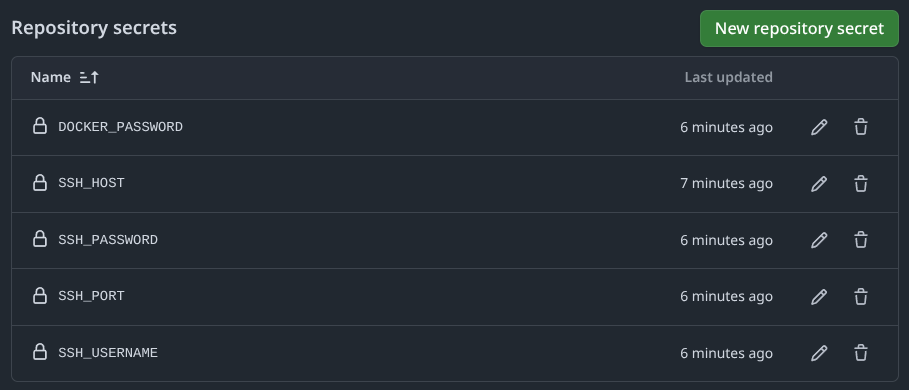

# Flask App CI/CD Pipeline with GitHub Actions

This repository demonstrates a complete CI/CD pipeline for a simple Flask application using GitHub Actions, Docker, and SSH deployment.

### Server Setup

1. SSH into your server:
   ```bash
   ssh username@your-server-ip
   ```

2. Install Docker:
   ```bash
   sudo apt update
   sudo apt install -y docker.io
   sudo systemctl start docker
   sudo systemctl enable docker
   sudo usermod -aG docker $USER
   ```
   
3. Log out and log back in for changes to take effect.

### GitHub Actions Configuration

#### Configure GitHub Secrets:
   - Navigate to your repository > Settings > Secrets and variables > Actions
   - Add the following secrets:
     - `DOCKER_USERNAME`: Your Docker Hub username
     - `DOCKER_PASSWORD`: Your Docker Hub password or access token
     - `SSH_HOST`: Your server's IP address
     - `SSH_USERNAME`: Your server's SSH username
     - `SSH_PASSWORD`: Your SSH password
     - `SSH_PORT`: Your SSH port (usually 22)

### Screenshot of GitHub Secrets Configuration


## CI/CD Pipeline Explanation

The CI/CD pipeline is defined in `.github/workflows/deploy.yml` and consists of the following steps:

1. **Checkout Code**: The workflow checks out the latest code from the repository.
2. **Set up Python**: Configures Python environment.
3. **Install Dependencies**: Installs the required Python packages.
4. **Build and Push Docker Image**: 
   - Builds a Docker image from the Dockerfile
   - Tags the image with the Docker Hub username
   - Pushes the image to Docker Hub
5. **Deploy to Server via SSH**:
   - Connects to the server using SSH
   - Stops and removes any existing container
   - Pulls the latest image from Docker Hub
   - Runs a new container with the updated image

### Screenshot of GitHub Actions Workflow Execution
<!-- [Will add screenshot here] -->

## Assumptions and Limitations

- This setup assumes you have a server with Docker installed and accessible via SSH.
- The application is exposed on port 5000, which might need to be adjusted based on your server's firewall settings or if you want to use a reverse proxy.
- For production use, you would want to add:
  - HTTPS support
  - A proper domain name
  - More comprehensive error handling
  - Health checks
  - Monitoring and logging
  - Database integration if needed

## Verification Steps

After pushing changes to the main branch:

1. Go to the "Actions" tab in your GitHub repository to monitor the workflow.
2. Once the workflow succeeds, visit http://your-server-ip:5000 to see your deployed application.

### Screenshot of Deployed Application
<!-- [Will add screenshot here] -->